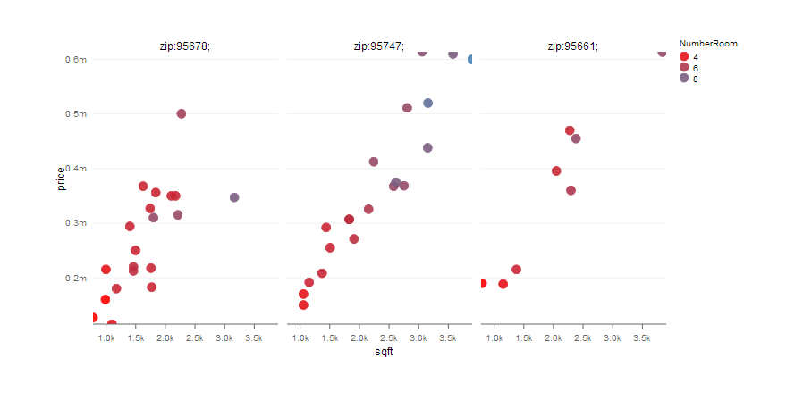

## Introduction
1. Inputs: city (in Sacramento county), zip, beds, baths, area, type  
2. Outputs: estimated price, a plot shows the prices in the city in the past 
</br>
<a href="https://ngoc-hien.shinyapps.io/SAC_HomePrice/">Try application here</a>
</br>
</br>


--- .class #id 

## Output plot  
 - The price is plotted by the area and zip
 - Colored according to the number of rooms (i.e. beds plus baths)
</br>


--- .class #id 

## Background  
 - Data: **Sacramento** from package **caret**  
 - Prediction model: a random forest model, 25 trees  
 - Web application: **shiny**  
 - Graph: **rCharts**

```{r echo=FALSE, eval=TRUE, message=FALSE, tidy=TRUE}
library(caret)
library(randomForest)
data("Sacramento")
str(Sacramento)
```

--- &twocol w1:70% w2:30% 

## Random forest model  

*** =left
price ~ city + zip + beds + baths + sqft + type 
```{r echo=FALSE, eval=TRUE, message=FALSE,  tidy=T}
library(caret)
library(randomForest)
data("Sacramento")
dat <- Sacramento[, -c(8,9)]
dat$zip <- substring(dat$zip, 2)
mod <- randomForest(price ~ ., data = dat,  ntree=25, importance=T)
print(mod)
```

*** =right

```{r echo=FALSE, eval=TRUE, message=FALSE, tidy=T}
varImpPlot(mod, type=2)
```
