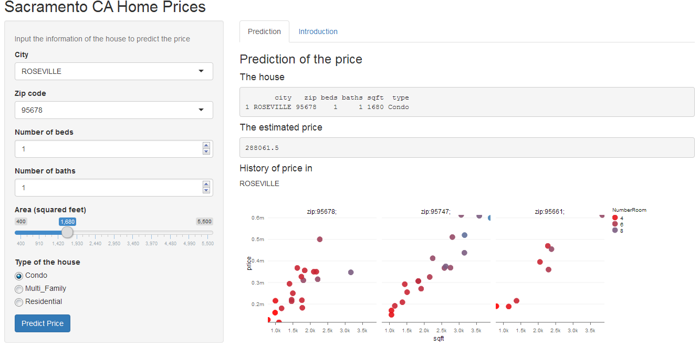
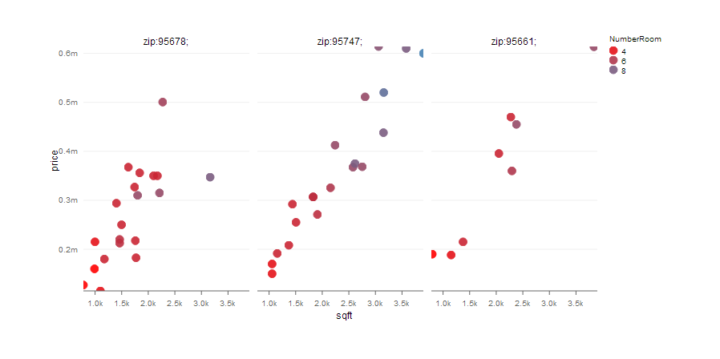
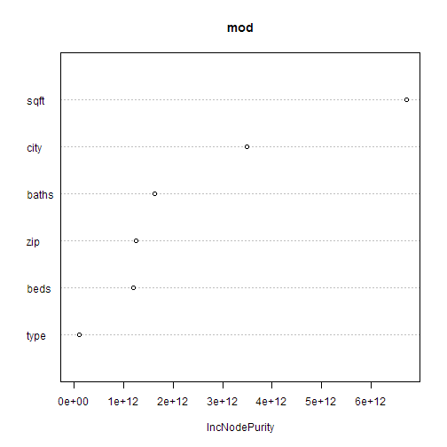

## Introduction
1. Inputs: city (in Sacramento county), zip, beds, baths, area, type  
2. Outputs: estimated price, a plot shows the prices in the city in the past 
</br>
<a href="https://ngoc-hien.shinyapps.io/SAC_HomePrice/">Try application here</a>
</br>
</br>


--- .class #id 

## Output plot  
 - The price is plotted by the area and zip
 - Colored according to the number of rooms (i.e. beds plus baths)
</br>


--- .class #id 

## Background  
 - Data: **Sacramento** from package **caret**  
 - Prediction model: a random forest model, 25 trees  
 - Web application: **shiny**  
 - Graph: **rCharts**


```
## 'data.frame':	932 obs. of  9 variables:
##  $ city     : Factor w/ 37 levels "ANTELOPE","AUBURN",..: 34 34 34 34 34 34 34 34 29 31 ...
##  $ zip      : Factor w/ 68 levels "z95603","z95608",..: 64 52 44 44 53 65 66 49 24 25 ...
##  $ beds     : int  2 3 2 2 2 3 3 3 2 3 ...
##  $ baths    : num  1 1 1 1 1 1 2 1 2 2 ...
##  $ sqft     : int  836 1167 796 852 797 1122 1104 1177 941 1146 ...
##  $ type     : Factor w/ 3 levels "Condo","Multi_Family",..: 3 3 3 3 3 1 3 3 1 3 ...
##  $ price    : int  59222 68212 68880 69307 81900 89921 90895 91002 94905 98937 ...
##  $ latitude : num  38.6 38.5 38.6 38.6 38.5 ...
##  $ longitude: num  -121 -121 -121 -121 -121 ...
```

--- &twocol w1:70% w2:30% 

## Random forest model  

*** =left
price ~ city + zip + beds + baths + sqft + type 

```
## 
## Call:
##  randomForest(formula = price ~ ., data = dat, ntree = 25, importance = T) 
##                Type of random forest: regression
##                      Number of trees: 25
## No. of variables tried at each split: 2
## 
##           Mean of squared residuals: 5941310716
##                     % Var explained: 65.41
```

*** =right


