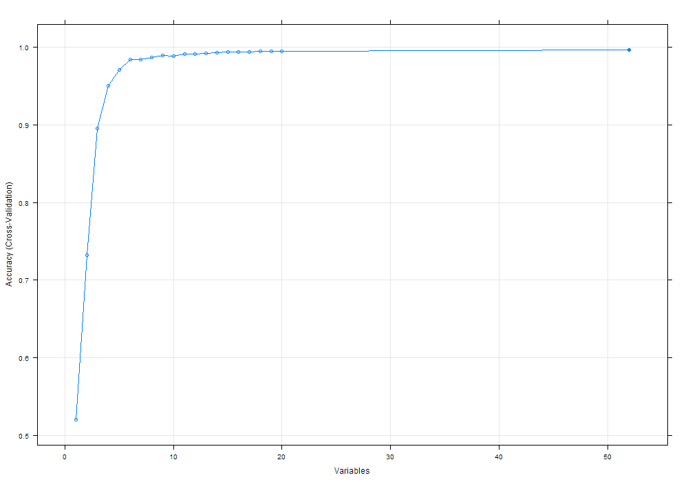

  
##1. Overview
People increasingly use devices to track personal activities. The goal of this project is to predict the manner in which people did the exercise. Six participants were asked to perform barbell lifts correctly and incorrectly in 5 different ways: exactly according to the specification (Class A), throwing the elbows to the front (Class B), lifting the dumbbell only halfway (Class C), lowering the dumbbell only halfway (Class D) and throwing the hips to the front (Class E). Using the data from accelerometers on the belt, forearm, arm, and dumbell of, a random forest model was built to classify five different fashions of the activities.  
We used 10-fold cross validation to train and test the model. The study was designed as follows.  

      1. Preprocessing  
         * Reading the training data  
         * Variables that had missing values were simply eliminated from the data. 
      2. Creating 10 folds for training    
      3. For each training fold  
         * Selecting features using recursive feature elimination algorithm (RFE)  
         * Modeling using random forest  
         * Testing = training data - training fold  
         * Testing and collecting the confusion matrix  
         
##2. Data and preprocessing  
The data has 19622 observations and 160 variables. After eliminating variables that have high amount of missing values and eliminating variables like user, id, timestamp, there are 52 variales as predictors and 1 class variable. 

##3. Modeling and testing with 10-fold cross validation  
We used random forest approach because it is suitable for a classification problem. The method is characterized by a number of decision trees and can handle high demensional data. It can also be used to select features with the recursive feature elimination algorithm. The advantage of using a model-based approach for the feature selection is that it is closely tied to the model performance and that it may be able to incorporate the correlation structure between the predictors into the varable importance calculation. 

###3.1. Feature selection and modeling    
Setting for the recursive feature elimination algorithm is: random forest approach as the function evaluating the contribution of variables into the model accuracy, evaluation with 10-fold cross validation, number of variables between 1 and 20. Top ten features were selected because they contributed to 99% of the accuracy. Those variables were **roll_belt**, **yaw_belt**, **magnet_dumbbell_z**, **pitch_belt**, **magnet_dumbbell_y**, **pitch_forearm**, **accel_dumbbell_y**, **roll_forearm**, **magnet_forearm_z**, **roll_dumbbell**.    

  
Figure 1. Feature selection with RFE  
```{r echo=FALSE, eval=FALSE, message=FALSE, tidy=TRUE}
# feature selection using RFE algorithm
control <- rfeControl(functions=rfFuncs, method="cv", number=10)
results <- rfe(training[,index.feature], training$classe[], sizes=c(1:20), rfeControl=control)
# select the top 10 of predictors
features <- predictors(results)[1:10]
# string of formula
fml <- paste("classe ~ ", paste( features, collapse = " + ", sep = " "))
# random forest model
rf.mod <- train(as.formula(fml), data = training, method="rf")
```

###2.2. Testing results  
The total accuracy is 99%. The accuracy for each class as follows that is also more than 98%. The error rate for A = 0.3%, B = 1.8%, C =  1.0%, D = 1.0%, E = 0.7%.
```{r echo=FALSE, eval=TRUE, message=FALSE, tidy=TRUE, results='hold'}
t <- rbind(c(5565, 26, 1, 0, 0), c(9, 3730, 19, 3, 10), c(3, 28, 3387, 25, 8), c(3, 13, 15, 3184,7), c(0,0,0,4,3582) )
colnames(t) <- LETTERS[1:5]
rownames(t) <- LETTERS[1:5]
cat("Confusion matrix\n")
cat("Prefrence (columes)\n")
t
normT <- t
normT <- apply(t, 2, function(x){x/sum(x)})
cat("Confusion matrix normalized by the number of true cases\n")
cat("Prefrence (columes)\n")
print(round(normT,3), zero.print = "0")
```
 


```{r echo=FALSE, eval=FALSE, message=FALSE, tidy=TRUE}
# return a rf model given a training set
activity.prediction.model <- function(training){
      # preprocessing
      # count the number of NA for each column
      # drop the column with count.na > 0
      count.na <- colSums(is.na(training))
      index.feature <- which(count.na[1:(ncol(training) - 1)]==0)
      # feature selection using RFE algorithm
      # select the top 10
      control <- rfeControl(functions=rfFuncs, method="cv", number=10)
      results <- rfe(training[,index.feature], training$classe[], sizes=c(1:20), rfeControl=control)
      features <- predictors(results)[1:10]
      # random forest model
      fml <- paste("classe ~ ", paste( features, collapse = " + ", sep = " "))
      rf.mod <- train(as.formula(fml), data = training, method="rf")
      rf.mod
}

# return a confusion table given a model and a test set
activity.testing <- function(rf.mod, testing){
      pred <- predict(rf.mod, newdata = testing)
      cm <- confusionMatrix(pred, testing$classe)
      cm.table <- cm$table
      cm.table
}

# perform cross validation for activity prediction
activity.cv <- function(){
      train.data <- read.csv("pml-training.csv", na.strings = c("", "NA", "#DIV/0!"))
      col.type <- sapply(train.data, FUN=class)
      #test types of columns
      which(col.type[]=="factor") 
      # drop out non-features, non-class columns
      train.data <- train.data[,8:ncol(train.data)]
      set.seed(123456)
      # 10-fold cross validation
      folds <- createFolds(train.data$classe, k=10, returnTrain = T)
      confusion.tb <- matrix(data = 0, nrow = 5, ncol = 5)
      nr <- nrow(confusion.tb)
      nc <- ncol(confusion.tb)
      for (i in 1:10){
            rf.mod <- activity.prediction.model(train.data[folds[[i]],])
            cm.tb <- activity.testing(rf.mod, train.data[-folds[[i]],])
            #cm.tb <- matrix(data = 2, nrow = 5, ncol = 5)
            for (r in 1:nr){
                  for (c in 1:nc){
                        confusion.tb[r,c] <- confusion.tb[r,c] + cm.tb[r,c]
                  }
            }
      }
      confusion.tb
}
```
